Does the user inserted the correct picture when the app requested? That's a pretty common problem companies faces when creating a onboarding process of a app or a web service. For example, during the onboarding process of a bank the app can ask for a selfie and the user insert a picture of it's ID. Since in those kind of processes there's a huge amount of requests at the same time, a manual validation process can't be used and a machine learning model can be a good alternative. TensorFlow and FastAPI can be used to create that solution.

We need also to deploy the model on the cloud so it can be available to the app. For that, we can use the serverless service AWS Lambda since it has a low cost and we don't need to worry about servers.

In this article a model will be created to classify ID's/driver's licenses photos, selfies and invalid photos using TensorFlow, then a API with FastAPI will be created, it'll be containeraized with Docker and deployed on AWS Lambda. The full repository of the project can be checked [here](https://github.com/vinybrasil/doc_classifier). 

## The data
For the model, three types of images are needed: photos of ID's, selfies and images so called "invalid" ones. 

For the ID's photos we can use the BID Dataset[[1]](https://sol.sbc.org.br/index.php/sibgrapi_estendido/article/view/12997). It is a dataset with photos of brazilian driver's licences and ID's photos with fake data built by brazilian researchers. Below there's a example of these images.

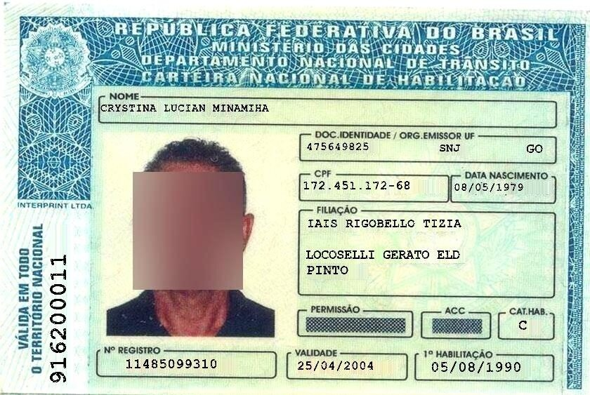

To download the dataset, we can use the following code on Google Colab:

```
!gdown --id 1Oi88TRcpdjZmJ79WDLb9qFlBNG8q2De6
```


For the selfies and invalid photos we can use the Selfie-Image-Detection-Dataset[[2]](https://www.kaggle.com/datasets/jigrubhatt/selfieimagedetectiondataset), which contains selfies and non-selfies/invalid photos.
A example of a selfie

||
|:----------------------:|

and of a invalid image

||
|:----------------------:|

To download the dataset we can use the Kaggle API using the following code also in Google Colab:

```python
!mkdir ~/.kaggle
!touch ~/.kaggle/kaggle.json

api_token = {"username":"yourkaggleusername","key":"YOURKAGGLEAPIKEY"}


with open('/root/.kaggle/kaggle.json', 'w') as file:
    json.dump(api_token, file)

!chmod 600 ~/.kaggle/kaggle.json

!kaggle datasets download -d jigrubhatt/selfieimagedetectiondataset
```


We now have the full dataset. We can split 80% for the training dataset and the rest for the test dataset.

## Data preparation and the model
We'll use the images in black and white. Also, the photos to be in the same size. We can use Tensorflow to perform these transformations:

```python
SIZE = 64
img_gray = tf.image.rgb_to_grayscale(img)
image_resized = tf.image.resize(img_gray, (SIZE, SIZE))
```

The model we'll train to classify the images is a CNN (Convolutional Neural Network) since it can handle pretty well the task of classifition of images. The code of the model is
```python
model = tf.keras.models.Sequential()
model.add(tf.keras.layers.Conv2D(64, (3, 3), activation='relu', input_shape=(SIZE, SIZE, 1)))
model.add(tf.keras.layers.MaxPooling2D((2, 2)))
model.add(tf.keras.layers.RandomCrop(16, 16))
model.add(tf.keras.layers.Conv2D(128, (3, 3), activation='relu'))
model.add(tf.keras.layers.MaxPooling2D((2, 2)))
model.add(tf.keras.layers.Dropout(.1))

model.add(tf.keras.layers.Flatten())
model.add(tf.keras.layers.Dense(256, activation='relu'))
model.add(tf.keras.layers.Dense(3))


model.compile(optimizer='adam',
              loss=tf.keras.losses.SparseCategoricalCrossentropy(from_logits=True), 
              metrics=['accuracy'])

history = model.fit(train_images, 
                    train_labels,
                    validation_split=0.2, 
                    callbacks=tf.keras.callbacks.EarlyStopping(patience=10), 
                    epochs=300, 
                    batch_size=64)

plt.plot(history.history['loss'])
plt.plot(history.history['val_loss'])
```


The output of the model is a vector with a score for each class. The softmax function can be used to transform these scores into probabilities. For each $z_{i}$ score of the $i$ class of the K classes, the softmax function can be written as:
$$ \sigma(z_i) = \frac{e^{z_i}}{\sum_{j=1}^{K} e^{z_j}} $$


We can now save the model using a method of the model class:
```python
model.save('model_v1')
```


It will create a folder and it looks like this

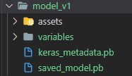

The full code for training the model can be checked [here](https://github.com/vinybrasil/doc_classifier/blob/main/notebooks/train_document_classifier.ipynb).

## Creating the API
To serve the model, we need to create an API and we'll use FastAPI because it's a fast and reliable library. 

The overall structure of the project is the following:
```
-> doc_classifier
	-> predictor
    	-> resources
        	-> model_v1
            	-> ...
    	-> make_prediction.py
    -> objects
    	-> output.py
    -> main.py
-> Dockerfile
-> pyproject.toml
-> lambda_function.py
```

We'll  explain all the files.
The main.py file should look like

```python
from typing import Optional

from fastapi import FastAPI

from doc_classifier.objects.output import OutputPrediction
from doc_classifier.predictor.make_prediction import predict

app = FastAPI()

@app.get("/health_check")
def read_root():
    return {"Ping": "Pong"}

@app.post("/classifier")
def classifier(req: Optional[dict]):
    prediction = predict(req["input_photo"])
    return OutputPrediction(
        leadId=req["leadId"], photoHash=prediction[1], prediction=prediction[0]
    )
```

The classifier route is the one we'll use to make the prediction. It recieves a dictionary containing two keys: the input_photo coded in base64 in a string format and the lead_id key to identification purposes. A example of the request in Python would be:

```python
import base64
import requests

encoded_string = base64.b64encode(open("test_doc_2.jpg", "rb").read())
encoded_string_utf = encoded_string.decode("utf-8")

print(
     requests.post(
         "http://localhost:8000/classifier",
         json={"input_photo": encoded_string_utf, "leadId": "f8cad38c-c4f3-4f50-ab23-5262033bfef1"},
     ).text
 )
```

We can test the API by running it with uvicorn:

```python
import uvicorn

if __name__ == "__main__":
    uvicorn.run("doc_classifier.main:app", host="0.0.0.0", port=8000, reload=True)
```

When the request in made, the function calls the predict function of the make_prediction.py file. The function decodes the image, turns it to grayscale, resizes it and call the model to make the prediction. 
```python
import base64
import io
import os

import numpy as np
import tensorflow as tf
from PIL import Image
from scipy.special import softmax
import imagehash

from doc_classifier.objects.output import Prediction, ProbabilitiesPrediction, RawPrediction

SIZE = 64

def load_model():
    package_dir = os.path.dirname(os.path.abspath(__file__))
    thefile = os.path.join(package_dir, "resources", "model_v8")
    model = tf.keras.models.load_model(thefile)
    return model


def bytes_to_array(image_b64):
    image_decoded = base64.b64decode(image_b64)
    image = Image.open(io.BytesIO(image_decoded))
    hash_photo = imagehash.average_hash(image)
    return np.asarray(image), hash_photo


def prepare_image(img):
    img_gray = tf.image.rgb_to_grayscale(img)
    image_resized = tf.image.resize(img_gray, (SIZE, SIZE))
    return np.asarray(image_resized).reshape(1, SIZE, SIZE, 1)


def predict(image_b64):
    model = load_model()
    image_as_array, hash_photo = bytes_to_array(image_b64)
     
    image_ready = prepare_image(image_as_array)
    raw_prediction = model.predict(image_ready)
    max_prob = np.argmax(softmax(raw_prediction[0]))
    class_predicted = ["selfie", "document", "invalid"][max_prob]

    prediction = Prediction(
        raw_prediction=RawPrediction(
            selfie_score=list(raw_prediction[0])[0],
            document_score=list(raw_prediction[0])[1],
            invalid_score=list(raw_prediction[0])[2]
        ),
        probabilities=ProbabilitiesPrediction(
            selfie_probability=list(softmax(raw_prediction[0]))[0],
            document_probability=list(softmax(raw_prediction[0]))[1],
            invalid_probability=list(softmax(raw_prediction[0]))[2]
        ),
        class_predicted=class_predicted,
    )
    return prediction, str(hash_photo)
```


The function returns a object of the Prediction class and a hash of the image to be store in a database so we don't need to classify the same image twice. The prediction class is built in the output.py file:

```python
import uuid
from typing import Optional

import arrow
from pydantic import BaseModel, Field, StrictStr


class RawPrediction(BaseModel):
    selfie_score: Optional[float]
    document_score: Optional[float]
    invalid_score: Optional[float]


class ProbabilitiesPrediction(BaseModel):
    selfie_probability: Optional[float]
    document_probability: Optional[float]
    invalid_probability: Optional[float]


class Prediction(BaseModel):
    raw_prediction: Optional[RawPrediction] = None
    probabilities: Optional[ProbabilitiesPrediction] = None
    class_predicted: Optional[StrictStr] = ""


class OutputPrediction(BaseModel):
    leadId: Optional[StrictStr]
    photoHash: Optional[StrictStr] = ""
    prediction: Optional[Prediction] = None
    requestId: Optional[str] = Field(default_factory=uuid.uuid4)
    timestamp: Optional[str] = Field(default_factory=arrow.now)
```


When the predict function returns the Prediction object, the classifier function of the main.py file combines the Predition object with the lead_id of the original request to build the OutputPrediction object. 
A response would be:

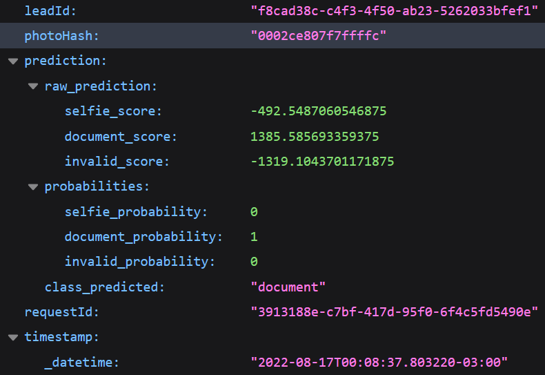

For dependencies management Poetry can be used. It's a package in Python similar to pip. In the root folder we can write

```
poetry init
```

It'll create a pyproject.toml file, where the details of the project can be written. The full file is

```
[tool.poetry]
name = "doc_classifier"
version = "0.1.0"
description = ""
authors = ["vinybrasil <vinicyusbrasil1@hotmail.com>"]

[tool.poetry.dependencies]
python = ">=3.8,<3.11"
tensorflow = "^2.8.2"
pillow = "^9.2.0"
arrow = "^1.2.2"
scipy = "^1.9.0"
fastapi = "^0.79.0"
imagehash = "^4.2.1"

[tool.poetry.dev-dependencies]

[build-system]
requires = ["poetry-core>=1.0.0"]
build-backend = "poetry.core.masonry.api"
```
With that we can install the API as a python package:

```
poetry install
```

In order to deploy on AWS Lambda, we need to create the lambda_function.py file in the root of the projects. It simply loads the app object of the main.py and calls the Mangum library.

```python
from mangum import Mangum
from doc_classifier.main import app

lambda_handler = Mangum(app, lifespan="off")
```

And that's it for the API.

# Deploying the API
With API ready, we can now containerize the with Docker. We'll be using the AWS version of Linux on the Docker container. On the Dockerfile we should write:

```
FROM public.ecr.aws/lambda/python:3.8

COPY doc_classifier/ ${LAMBDA_TASK_ROOT}/doc_classifier/
COPY lambda_function.py ${LAMBDA_TASK_ROOT}
COPY pyproject.toml ${LAMBDA_TASK_ROOT}


ENV PATH /home/$(python3 -m site --user-base)/.local/bin:${PATH}

RUN pip install poetry mangum  && poetry config virtualenvs.create false && poetry update && poetry install

CMD [ "lambda_function.lambda_handler" ]
```
This implementation is based on the tutorial by AWS[[3]](https://docs.aws.amazon.com/lambda/latest/dg/images-create.html). The LAMBDA_TASK_ROOT is a variable with the value /var/task. 

Before creating the container, a repository in the AWS ECR (Elastic Container Registry) is needed. It can be created on AWS managment tool, searching for ECR, clicking in "create repository" and filling the informations needed.

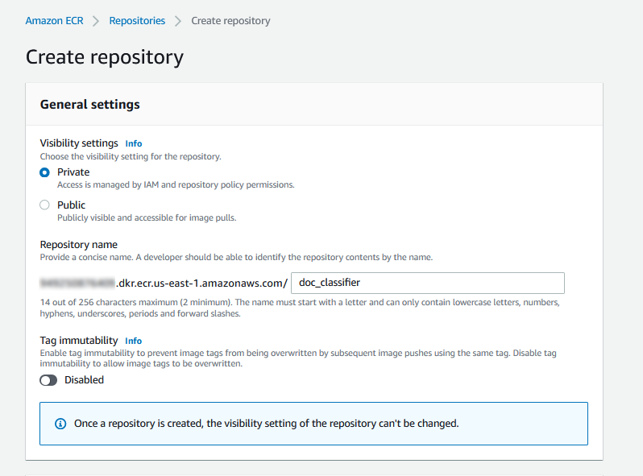

Following Cardoso's tutorial[[4]]( https://medium.com/dataengineerbr/how-to-run-aws-lambda-locally-on-your-computer-with-docker-containers-533a3add1b45), 
the container can be created by tipyng

```
docker build -t doc_classifier . 
```

Tagging the image:

```
docker tag doc_classifier:latest AWSUSERIDHERE.dkr.ecr.us-east-1.amazonaws.com/doc_classifier:latest
```

Give permission to your CLI to access ECR:  [https://docs.aws.amazon.com/lambda/latest/dg/images-create.html]

```
aws ecr get-login-password --region us-east-1 | docker login --username AWS --password-stdin AWSUSERIDHERE.dkr.ecr.us-east-1.amazonaws.com
```

Pushing it to the repository:
```
docker push AWSUSERIDHERE.dkr.ecr.us-east-1.amazonaws.com/doc_classifier:latest
```

We can know see the image in ECR:

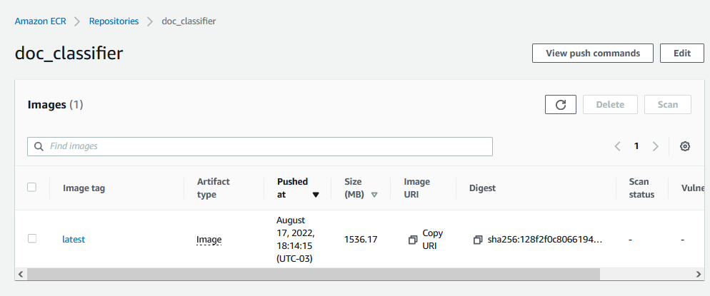

The Lambda function can now be created. Searching for "Lambda" in the AWS search bar and clicking in "create function", the following screen should apper:

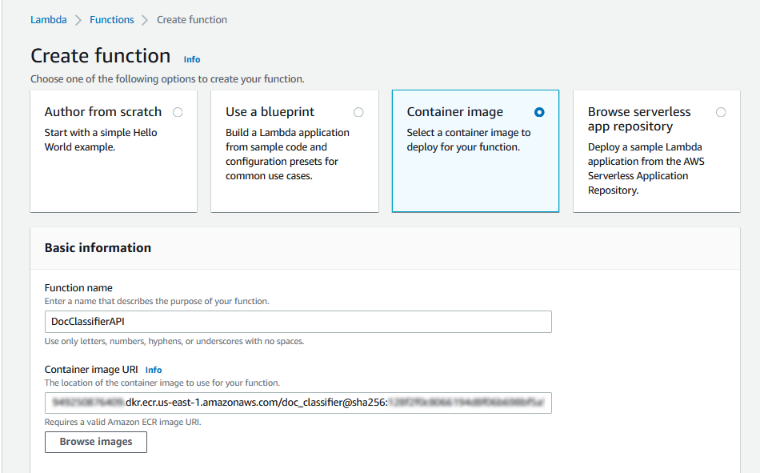

By selecting to create the lambda function with a container, the container can be selected in the "browse images" button.

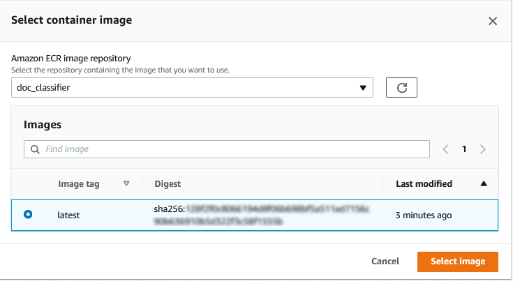

Under "Container image overrides" the variable "/var/task" shall be set in the WORKDIR box.

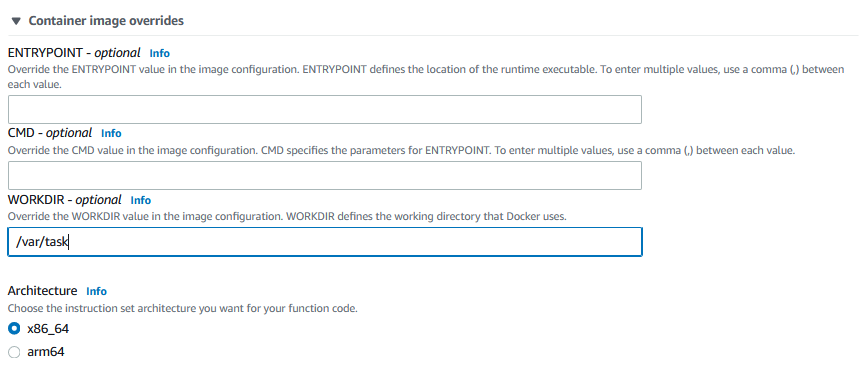

Finish the creation step by clicking  in the "create function" button. Since the model consumes some memory, we must increase the memory and the timeout limit of the lambda function.

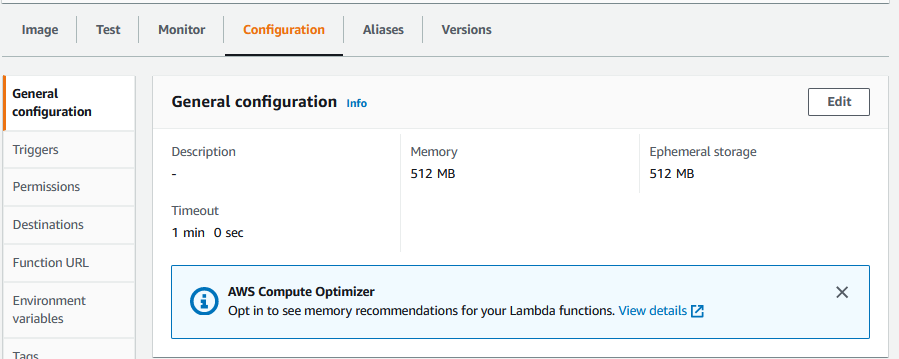

The last step is to set the API Gateway as a trigger so we can call our model with a HTTP request. By searching by "API Gateway" in AWS search bar and clicking in API, we can select to create a new one and to create a HTTP API:

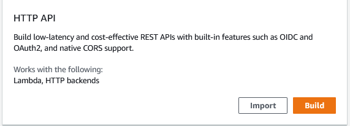

The API can now be integrated it with the Lambda function created earlier:

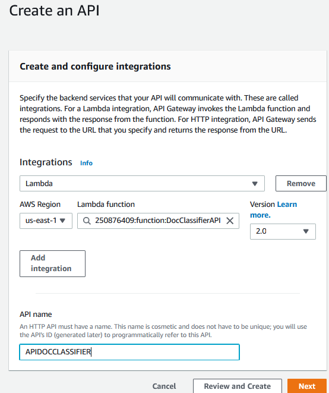

The last step is to map the routes of the API Gateway to the routes of the API inside the Lambda function:

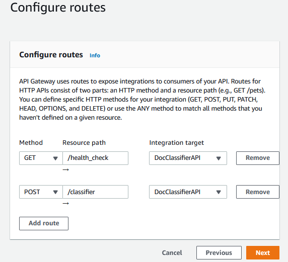

And that's it. By finishing the creation and going back to the lambda function screen, we shall see the following screen:

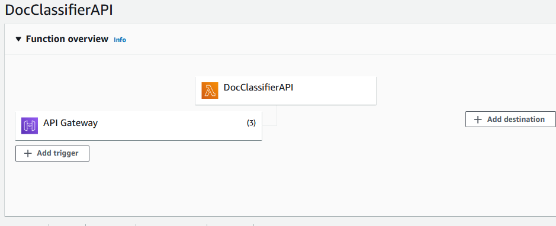

The routes we created are now related to a URL:

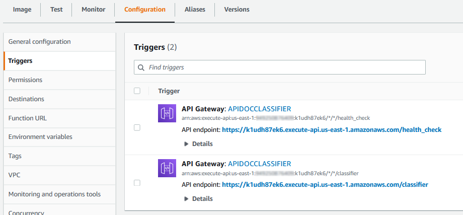

So now our function can receive HTTP requests in those URLS. Using the following code to test:

```python
import base64
import requests

encoded_string = base64.b64encode(open("test_doc_2.jpg", "rb").read())
encoded_string_utf = encoded_string.decode("utf-8")

print(
     requests.post(
         "https://k1udh87ek6.execute-api.us-east-1.amazonaws.com/classifier",
         json={"input_photo": encoded_string_utf, "leadId": "f8cad38c-c4f3-4f50-ab23-5262033bfef1"},
     ).text
 )
```

We shall receive the following response:

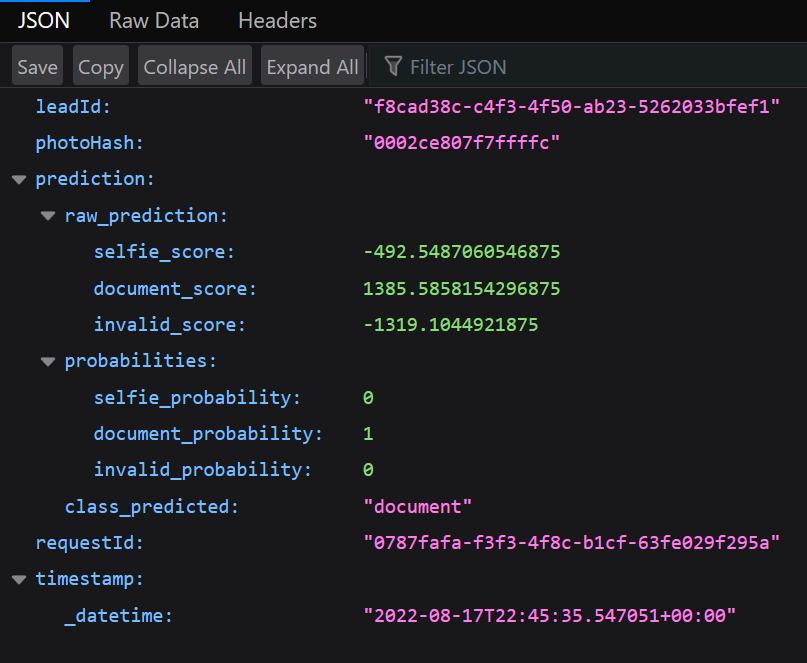


That's it. Our model can know give predictions to photos, everything in the cloud.  Feel free to comment, explore the code on Github or contact me via LinkedIn. Keep on learning :D

# References

[1] BID Dataset: a challenge dataset for document processing tasks.  https://sol.sbc.org.br/index.php/sibgrapi_estendido/article/view/12997

[2] Selfie-Image-Detection-Dataset. https://www.kaggle.com/datasets/jigrubhatt/selfieimagedetectiondataset

[3] Creating Lambda container images. https://docs.aws.amazon.com/lambda/latest/dg/images-create.html

[4] How to run AWS Lambda on your computer using Docker containers. https://medium.com/dataengineerbr/how-to-run-aws-lambda-locally-on-your-computer-with-docker-containers-533a3add1b45