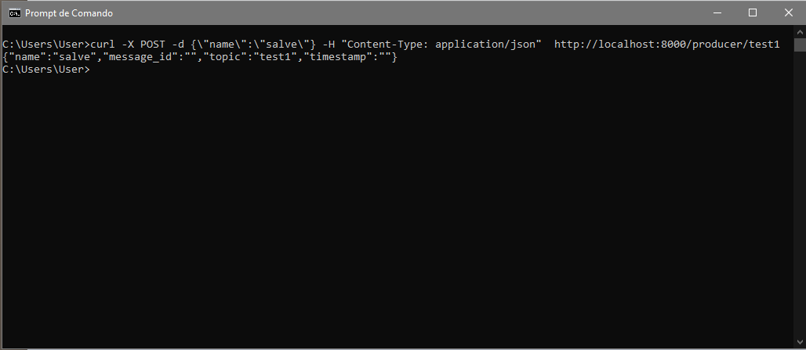

Writing asynchronous code it's worth the effort when you're dealing with a high load or multiple microservices that can take some time to answer your calls. The purpose of this article is to create an simple asynchronous API that works the same time as a Kafka's producer and consumer. The full project it's on my [Github](https://github.com/vinybrasil/fastapi_kafka). 


### Setting up Kafka

In this tutorial we'll be using Docker to set up Kafka following the [Shuyi Yang's tutorial[1]](https://towardsdatascience.com/kafka-docker-python-408baf0e1088). The docker-compose.yml file used will be:


```yml
version: '2'
services:
  zookeeper:
    image: confluentinc/cp-zookeeper:latest
    environment:
      ZOOKEEPER_CLIENT_PORT: 2181
      ZOOKEEPER_TICK_TIME: 2000
    ports:
      - 22181:2181
  
  kafka:
    image: confluentinc/cp-kafka:latest
    depends_on:
      - zookeeper
    ports:
      - 29092:29092
    environment:
      KAFKA_BROKER_ID: 1
      KAFKA_ZOOKEEPER_CONNECT: zookeeper:2181
      KAFKA_ADVERTISED_LISTENERS: PLAINTEXT://kafka:9092,PLAINTEXT_HOST://localhost:29092
      KAFKA_LISTENER_SECURITY_PROTOCOL_MAP: PLAINTEXT:PLAINTEXT,PLAINTEXT_HOST:PLAINTEXT
      KAFKA_INTER_BROKER_LISTENER_NAME: PLAINTEXT
      KAFKA_OFFSETS_TOPIC_REPLICATION_FACTOR: 1
```

To create it, we can navigate to the folder and write:
```
docker-compose -f docker-compose.yml up
```

OBS: I'm using Windows, so commands might differ in Linux distros or MacOS. <br>
We can now create a topic:

```
docker exec -ti kafka /opt/kafka/bin/kafka-topics.sh --create --zookeeper zookeeper:2181 --replication-factor 1 --partitions 1 --topic test1
```

And write some events to it:
```bash
## Write events
docker exec -ti kafka /opt/kafka/bin/kafka-console-producer.sh --topic test1 --bootstrap-server localhost:9092

## Read events
docker exec -ti kafka /opt/kafka/bin/kafka-console-consumer.sh --topic test1 --from-beginning --bootstrap-server localhost:9092
```


### Creating the API

We'll be using the library aiokafka to deal with Kafka and FastAPI to create the API, as in the awesome tutorial by [iwpnd[2]](https://iwpnd.pw/articles/2020-03/apache-kafka-fastapi-geostream). To simplify, the project will only have one python file called main.py. Importing the necessary libraries:

```python
import asyncio
import json

from pydantic import BaseModel, StrictStr
from aiokafka import AIOKafkaConsumer, AIOKafkaProducer
from fastapi import FastAPI
```


Now, we need to create the FastAPI class and the loop objects.
```python
app = FastAPI()

loop = asyncio.get_event_loop()

KAFKA_INSTANCE = "localhost:29092"
```


The loop object will be referenced in the creating of the Producer and the Consumer classes:
```python
aioproducer = AIOKafkaProducer(loop=loop, bootstrap_servers=KAFKA_INSTANCE)

consumer = AIOKafkaConsumer("test1", bootstrap_servers=KAFKA_INSTANCE, loop=loop)
```


For the consumer part, we can create a consume function which has the purpose of printing the message of the topic (and it's proprieties) in the server terminal everytime a new one arrives.
```python
async def consume():
    await consumer.start()
    try:
        async for msg in consumer:
            print(
                "consumed: ",
                msg.topic,
                msg.partition,
                msg.offset,
                msg.key,
                msg.value,
                msg.timestamp,
            )

    finally:
        await consumer.stop()
```


Now here's the trick for the function of the consumer runs forever: the consume() function must be created at the startup of the API. With that, we guarantee that the function is running all the time.

```python
@app.on_event("startup")
async def startup_event():
    await aioproducer.start()
    loop.create_task(consume())


@app.on_event("shutdown")
async def shutdown_event():
    await aioproducer.stop()
    await consumer.stop()
```

We can now create the POST route that will produce the message when someone calls it. Here we got two classes to standardize the input.
```python
class ProducerResponse(BaseModel):
    name: StrictStr
    message_id: StrictStr
    topic: StrictStr
    timestamp: StrictStr = ""

class ProducerMessage(BaseModel):
    name: StrictStr
    message_id: StrictStr = ""
    timestamp: StrictStr = ""

@app.post("/producer/{topicname}")
async def kafka_produce(msg: ProducerMessage, topicname: str):

    await aioproducer.send(topicname, json.dumps(msg.dict()).encode("ascii"))
    response = ProducerResponse(
        name=msg.name, message_id=msg.message_id, topic=topicname
    )

    return response
```


And that's it for the API. We can start it using uvicorn:

```bash
uvicorn main:app --reload
```


We can also test it using cURL:
```bash
curl -X POST -d {\"name\":\"salve\"} -H "Content-Type: application/json"  http://localhost:8000/producer/test1
```


It should return something like this:




In the server terminal, the results should look like:


That's it. Feel free to ask any questions or to contribute in the github repository or in my personal email.

### References

[1] Shuyi Yang. Apache Kafka: Docker Container and examples in Python. Available at https://towardsdatascience.com/kafka-docker-python-408baf0e1088

[2] iwpnd. Apache Kafka producer and consumer with FastAPI and aiokafka. Available at https://iwpnd.pw/articles/2020-03/apache-kafka-fastapi-geostream