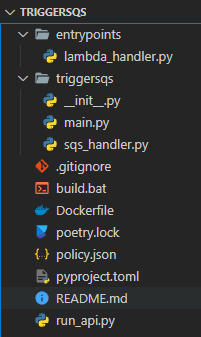
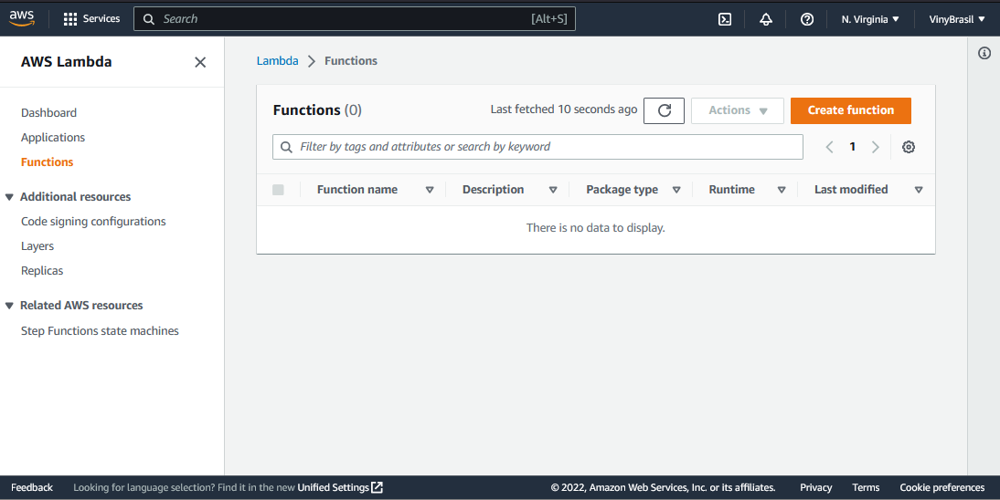
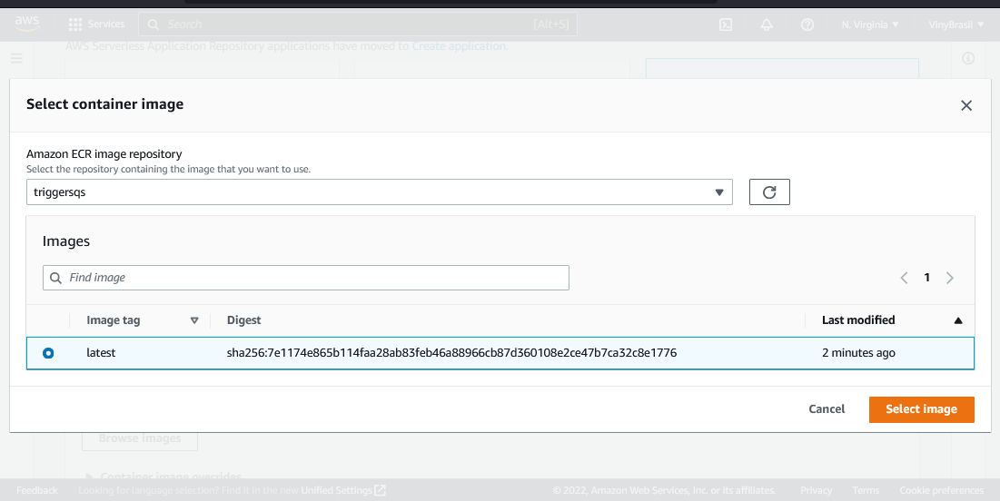
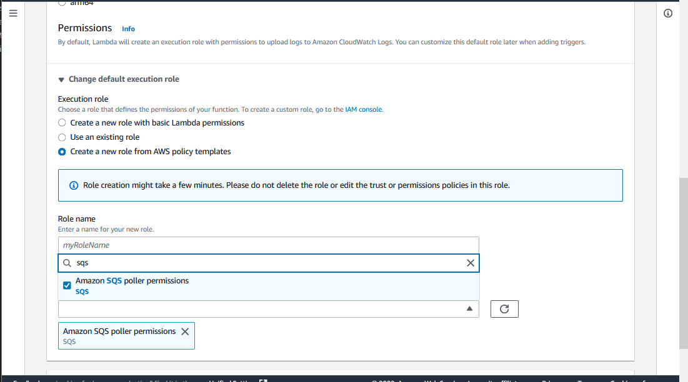
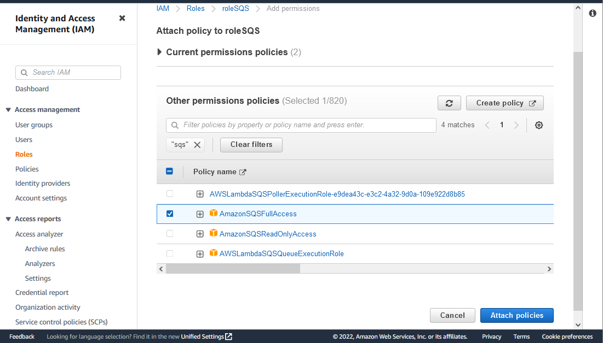
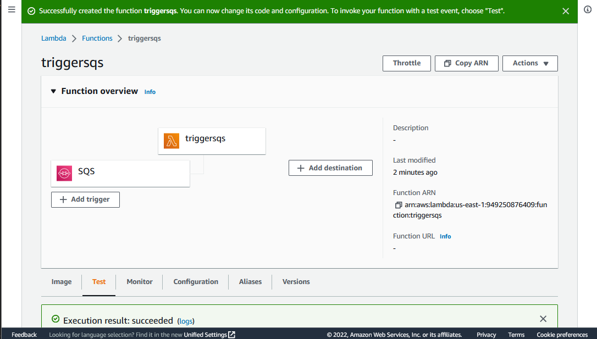
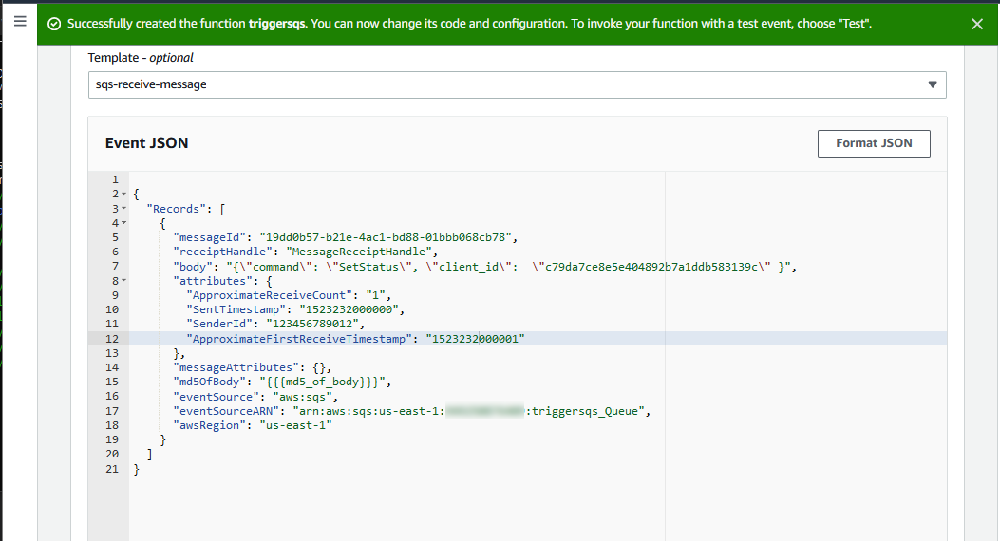
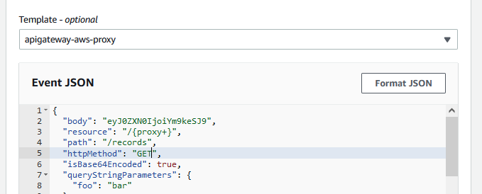
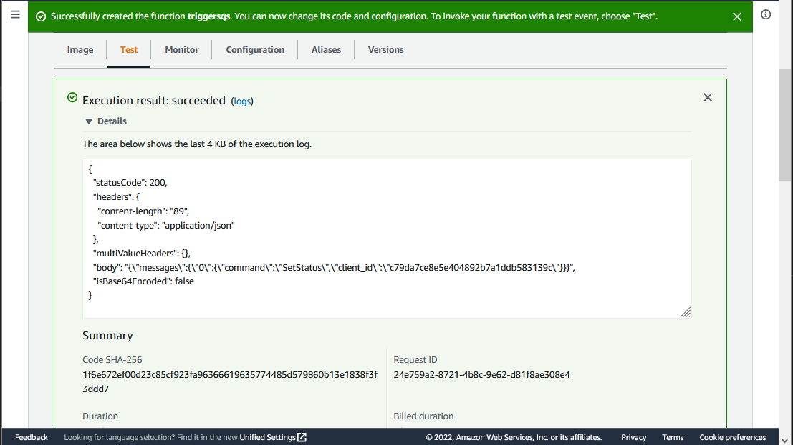

## Introduction

In the context of microservices, the communication of them must be fast and realiabe. This communication can be through messages and a tool for this communication can be SQS (Simple Queue Service), a messaging service by AWS. 

This project will be a example of a system that can receive a SQS message from a client, process it, and give the information to another client. As a example of this process, we'll create a microservice in a AWS Lambda that will act when receive a SQS message. It'll write the message in a .txt file and return all the messages when receives a HTTP call to a certain endpoint. We'll be using AWS Lambda because it is a serverless framework, in which the idea is you don't have to worry about servers. 

Python's library FastAPI will be used to create the API, Docker to containerize it and Poetry will be the library manager. As always, the [code of the project is on my Github](https://github.com/vinybrasil/triggersqs).

## Building the API

We'll be using FastAPI as the backend tool for this project. The package has a simple syntax and makes easy to create APIs. To create a health check route: 

```python
from fastapi import FastAPI
import json

app = FastAPI()

@app.get("/healthcheck")
def root():
    return {"message": "health check"}
```

Calling the file main.py, Uvicorn can run this API by running the following code:
```python
import uvicorn

if __name__ == "__main__":
    uvicorn.run("main:app", host="0.0.0.0", port=8000, reload=True)

```

Inside the main.py file, we'll create another route called "/records". When the API receives a SQS message, it writes it down on a .txt file called "log.txt". The new route retrives all of the messages in the file. The full "main.py" will be
```python
from fastapi import FastAPI
import json

app = FastAPI()

@app.get("/healthcheck")
def root():
    return {"message": "health check"}

@app.get("/records")
def root():
    try:
        with open('/tmp/' +  "log.txt", 'r') as fp:
            line = fp.readlines()

        lines = [ json.loads(x.replace("\n", "").replace("'", '"')) for x in line]
        b = {}

        for i in range(len(lines)):
            b[f"{i}"] =  lines[i]
        return  {"messages": b}

    except: #when there are no messages
        return {"messages": {}}
```

## Creating the SQS handler

To create the SQS handler, we first need to undestand how our Lambda will receive the SQS message. It will come in a JSON like this
```
{
  "Records": [
    {
      "messageId": "19dd0b57-b21e-4ac1-bd88-01bbb068cb78",
      "receiptHandle": "MessageReceiptHandle",
      "body": "Hello world",
      "attributes": {
        "ApproximateReceiveCount": "1",
        "SentTimestamp": "1523232000000",
        "SenderId": "123456789012",
        "ApproximateFirstReceiveTimestamp": "1523232000001"
      },
      "messageAttributes": {},
      "md5OfBody": "{{{md5_of_body}}}",
      "eventSource": "aws:sqs",
      "eventSourceARN": "arn:aws:sqs:us-east-1:123456789012:mysqs",
      "awsRegion": "us-east-1"
    }
  ]
}
```

There's a few details here. First of all, the eventSourceARN, which is the address of the SQS Queue. The second is the body of the message. For this example, we want to receive messages in the format of 
```
{"command": "SetStatus", "client_id": "c79da7ce8e5e"}
```

A parser must be created to extract the data and put it in a object called Message. 
```python
from pydantic import BaseModel
import json 

ARN_SOURCE = f'arn:aws:sqs:us-east-1:123456789012:triggersqs_Queue'

class Message(BaseModel):
    command: str
    client_id: str

class SQSHandler():
    def __init__(self, ARN_SOURCE):
        self.ARN_SOURCE = ARN_SOURCE

    def parse_messages(self, event):
        messages = [Message(**json.loads(record['body'])) for record in event.get("Records", []) if record['eventSourceARN'] == self.ARN_SOURCE]
        return messages
```

The ideia is to create a object which will be receiving a ARN_SOURCE variable, the ARN of the SQS queue. It will only try to parse the messages from that queue and will try to parse based on the Message Class in the function parse_messages. If it can, will return an object of the Message Class. Replace the ARN_SOURCE variable with the one will create in a moment. Our handler will be then
```python
def handler_sqs(event):

    sqs_handler = SQSHandler(ARN_SOURCE)
    messages = sqs_handler.parse_messages(event)

    for message in messages:
        open('/tmp/' +  "log.txt", 'a+').write(str(message.dict()) + "\n")
```

It will try to parse the messages and write it down to a log.txt file. 
The full sqs_handler.py will be

```python
from pydantic import BaseModel
import json 
import os

ARN_SOURCE = f'arn:aws:sqs:us-east-1:123456789012:mysqs'

class Message(BaseModel):
    command: str
    client_id: str

class SQSHandler():
    def __init__(self, ARN_SOURCE):
        self.ARN_SOURCE = ARN_SOURCE

    def parse_messages(self, event):
        messages = [Message(**json.loads(record['body'])) for record in event.get("Records", []) if record['eventSourceARN'] == self.ARN_SOURCE]
        return messages

def handler_sqs(event):

    sqs_handler = SQSHandler(ARN_SOURCE)
    messages = sqs_handler.parse_messages(event)

    for message in messages:
        open('/tmp/' +  "log.txt", 'a+').write(str(message.dict()) + "\n")
```


That's it for the API. We need to create the lambda_handler.py now
```python
from mangum import Mangum
from triggersqs.main import app
from triggersqs.sqs_handler import handler_sqs

def event_handler(event, context):
    if event.get("Records"):
        return handler_sqs(event)

    if event.get("httpMethod"):
        asgi_handler = Mangum(app)
        return asgi_handler(event, context)
        
    #other handlers here


def lambda_handler(event, context):
    return event_handler(event, context)
```

Everytime it receives a event, it will check if it's a HTTP request (which Mangum will handle) or if it's a SQS message (which our handler sqs_handler.py will handle).
The  t will be

 

To handle our dependencies, we can use poetry

```
poetry init
poetry add fastapi uvicorn mangum pydantic
```

We can use Docker to containerize the project
```
FROM public.ecr.aws/lambda/python:3.8 as build

COPY ./pyproject.toml .
COPY triggersqs/ triggersqs/

RUN pip install poetry && \
    poetry config virtualenvs.create false && \
    poetry install

COPY entrypoints/lambda_handler.py lambda_handler.py

CMD ["lambda_handler.lambda_handler"]
```

## Creating the ECR and the SQS Queue

To deploy the package to a AWS Lambda, we first need to create a repository and upload the image.
We can also create the SQS object here. Export your AWS Account Id to a enviroment variable 
called AWSACCOUNTID and run:

```
docker build -t triggersqs:latest -t %AWSACCOUNTID%.dkr.ecr.us-east-1.amazonaws.com/triggersqs:latest . -f Dockerfile

aws ecr create-repository --repository-name triggersqs

aws ecr get-login-password --region us-east-1 | docker login --username AWS --password-stdin 949250876409.dkr.ecr.us-east-1.amazonaws.com 

aws sqs create-queue --queue-name triggersqs_Queue

docker push %AWSACCOUNTID%.dkr.ecr.us-east-1.amazonaws.com/triggersqs:latest 
```

## Creating the Lambda

We can create the Lambda in a lot a different ways, from the CLI or using some Infra as a Code
tool (like Terraform). I strongly
recommend the use of Terraform, mainly because you can replicate the same infrastructure in many 
different enviroments.  For this tutorial we'll be using the management console, mainly because of the simplicity.

A Lambda function can be created on the AWS Lambda page:

 

Our Lambda will use the container created before:

 

We need to give access to the SQS in the role of the Lambda. We can do this by adding:

 

An alternative is to add full access to the SQS services on the role of the Lambda. By finding the role of the Lambda, we need to attach the following policy:

 


Our final Lambda should look something like this:
 

## Testing
To test it, we can test it using the Test tab on the same Lambda 
page we are working. First, we need to test receving a SQS message:

 

Now a API call to the endpoint /records to get all the messages:
 

The response should be
 

That's it. Feel free to ask me any questions, explore the code on Github or contact me via LinkedIn. Keep on learning :D