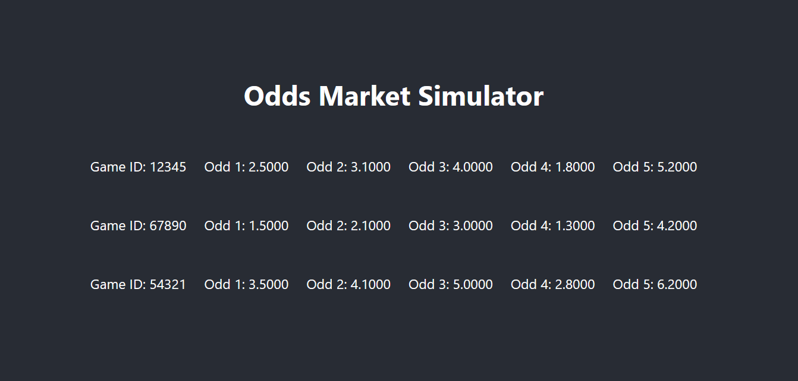
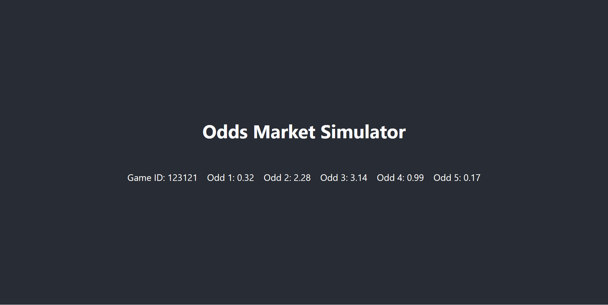
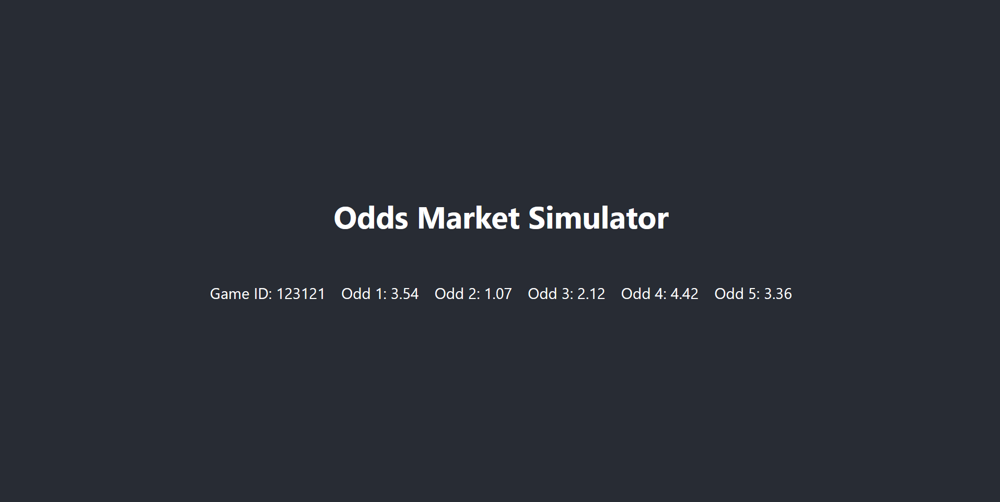
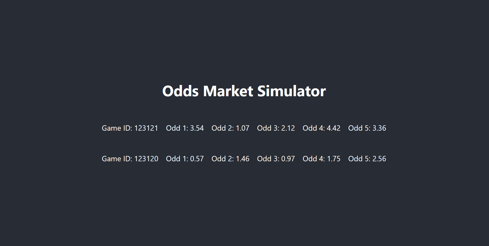
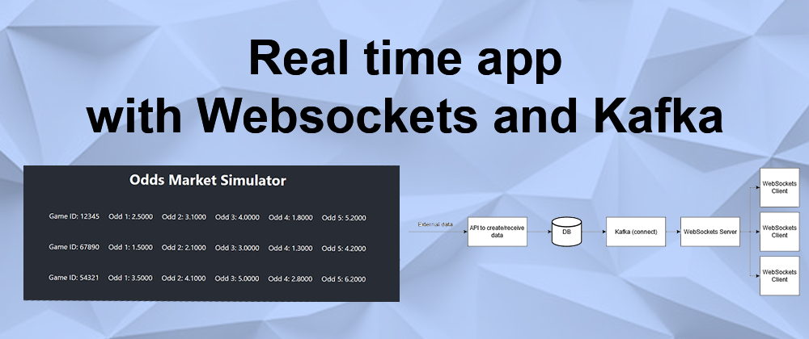

## Introduction

Suppose we have a API that generates a lot of information whom we must store in a database and show them to clients. This information updates every few seconds 
and this sort of system is call a real-time app (in reality, it takes some seconds, so it's a near real time app). Some applications that can use this sort of design are:

- chatbots: the API is a LLM that receives an input and send it's response to the client;

- systems with time series: the API fetches data from somewhere (like some temperature reading) and updates in real time to the client;

- systems with position in space: the API fetches data from a train (or a car) and updates show them to someone waiting (like a Uber passenger);

- sports betting: the API calculate the odds of something happen in the game and updates it to the client.

In this project we'll build a near real-time app. We've chosen to build a simple sports betting app that will only show the clients updated odds.
The webapp will send a `websocket message` to their clients after
receiving a message from a Kafka topic. This message comes from a `new record being inserted in the database` 
from a API and captured by Kafka-Connect with the debezium plugin.  

The design of the system follows: a API receives external data and insert it to the database, Kafka Connect get the payload inserted and send it to 
a Kafka topic. A websocket server is consuming the messages from this topic and, when receives a message, send it to the websockets clients. 
This design allows the system to be scalable since some of the components can work asynchronously, therefore the ones with more load can be horizontally scaled. 
The image below ilustrates it. 
[]($image.asset("websocket.png")) 


There are four main steps to build this system:

1) setup Kafka and Kafka connect with the debezium plugin;
2) setup the database (MySQL) and the scripts to initialize it correctly;
3) build the API to create the data;
4) create the websocket server and the client;

Here I'll only share some parts of the code because the full project is too large and the full code is on 
this [Github repository](https://github.com/vinybrasil/websocket-kafka). 


## Setting up Kafka Connector and debezium (the docker-compose file)

To use Kafka we need Zookeeper, also included in the following docker-compose file. The file also creates the database and uses default password and username.
Kafka-Connect installing the debezium plugin is where the magic happens. The plugin is responsable for get the data inserted in the database and push it to a 
Kafka topic. The version of docker used is 20.10.12, the docker-compose version is v2.29.1-desktop.1 and here's the code for the docker-compose file.

```bash
services:
  zookeeper:
    image: confluentinc/cp-zookeeper:7.8.0
    container_name: zookeeper
    ports:
      - "2181:2181"
    environment:
      ZOOKEEPER_CLIENT_PORT: 2181

  kafka:
    image: confluentinc/cp-kafka:7.8.0
    container_name: kafka
    ports:
      - "9092:9092"
    environment:
      KAFKA_BROKER_ID: 1
      KAFKA_ZOOKEEPER_CONNECT: zookeeper:2181
      KAFKA_LISTENER_SECURITY_PROTOCOL_MAP: PLAINTEXT:PLAINTEXT,PLAINTEXT_HOST:PLAINTEXT
      KAFKA_INTER_BROKER_LISTENER_NAME: PLAINTEXT
      KAFKA_ADVERTISED_LISTENERS: PLAINTEXT://kafka:29092,PLAINTEXT_HOST://localhost:9092
      KAFKA_AUTO_CREATE_TOPICS_ENABLE: "true"
      KAFKA_OFFSETS_TOPIC_REPLICATION_FACTOR: 1
      KAFKA_TRANSACTION_STATE_LOG_MIN_ISR: 1
      KAFKA_TRANSACTION_STATE_LOG_REPLICATION_FACTOR: 1
      KAFKA_GROUP_INITIAL_REBALANCE_DELAY_MS: 100
    depends_on:
      - zookeeper

  mysql:
    image: mysql:8.0
    container_name: mysql
    ports:
      - 3306:3306
    environment:
     - MYSQL_ROOT_PASSWORD=debezium
     - MYSQL_USER=mysqluser
     - MYSQL_PASSWORD=mysqlpw
    volumes:
     - ${PWD}/data/mysql:/docker-entrypoint-initdb.d
     - ${PWD}/data:/data
     - ./mysql-init:/docker-entrypoint-initdb.d
  schema-registry:
    image: confluentinc/cp-schema-registry:7.8.0
    container_name: schema-registry
    ports:
      - "8081:8081"
    depends_on:
      - kafka
    environment:
      SCHEMA_REGISTRY_HOST_NAME: schema-registry
      SCHEMA_REGISTRY_KAFKASTORE_BOOTSTRAP_SERVERS: kafka:29092
  kafka-connect:
    image: confluentinc/cp-kafka-connect-base:7.8.0
    container_name: kafka-connect
    depends_on:
      - kafka
      - schema-registry
    ports:
      - 8083:8083
    environment:
      CONNECT_BOOTSTRAP_SERVERS: "kafka:29092"
      CONNECT_REST_PORT: 8083
      CONNECT_GROUP_ID: kafka-connect
      CONNECT_CONFIG_STORAGE_TOPIC: _connect-configs
      CONNECT_OFFSET_STORAGE_TOPIC: _connect-offsets
      CONNECT_STATUS_STORAGE_TOPIC: _connect-status
      CONNECT_KEY_CONVERTER: org.apache.kafka.connect.storage.StringConverter
      CONNECT_VALUE_CONVERTER: io.confluent.connect.avro.AvroConverter
      CONNECT_VALUE_CONVERTER_SCHEMA_REGISTRY_URL: 'http://schema-registry:8081'
      CONNECT_REST_ADVERTISED_HOST_NAME: "kafka-connect"
      CONNECT_LOG4J_APPENDER_STDOUT_LAYOUT_CONVERSIONPATTERN: "[%d] %p %X{connector.context}%m (%c:%L)%n"
      CONNECT_CONFIG_STORAGE_REPLICATION_FACTOR: "1"
      CONNECT_OFFSET_STORAGE_REPLICATION_FACTOR: "1"
      CONNECT_STATUS_STORAGE_REPLICATION_FACTOR: "1"
      CONNECT_PLUGIN_PATH: /usr/share/java,/usr/share/confluent-hub-components,/data/connect-jars
    volumes:
      - $PWD/data:/data
    command:
      - bash
      - -c
      - |
        echo "Installing Connector"
        confluent-hub install --no-prompt debezium/debezium-connector-mysql:1.7.0
        #
        echo "Launching Kafka Connect worker"
        /etc/confluent/docker/run &
        #
        sleep infinity

networks:
  my-network-name:
   name: websockets
```

Note we are naming the network that docker will use. It is importante because all of the services must be in the same network. To run it:

```bash
docker-compose up -f docker-compose.yml -d 
```

## Setting up the database

Each game will use a table in the database "gameodds" and the table will be called game_{gameid}, where {gameid} is a int 
identifing each game. By creating the database we also need to grant the privileges to the user (please, don't let 
credentials like this explicity in the code in production, you're gonna get yourself fired).

I chose MySQL because it's simple but you can use another database since debezium has plugins in their [website](https://debezium.io/documentation/reference/stable/connectors/index.html) for MongoDB, PostgreSQL etc.
The following script file will to be in the 'mysql-init' folder and it will run every time docker-compose up. 

```bash
CREATE USER 'debezium'@'%' IDENTIFIED BY 'dbz';

GRANT ALL PRIVILEGES ON *.* TO 'debezium'@'%' WITH GRANT OPTION;

FLUSH PRIVILEGES;


CREATE DATABASE IF NOT EXISTS gameodds;

USE gameodds;

CREATE TABLE IF NOT EXISTS available_games (
    row_id INT AUTO_INCREMENT PRIMARY KEY,
    game_id VARCHAR(50) NOT NULL,
    game_id_name VARCHAR(50) NOT NULL,
    connector_name VARCHAR(100) NOT NULL,
    created_at TIMESTAMP DEFAULT CURRENT_TIMESTAMP
);
```

## API to send request to database


The API needs two routes:

  - /games: the game odds will be stored in a table called "available_games". Calling a POST request to this route will create the table and then
   send a POST request to Kafka-Connect to create the connector,
  which will create the topic in Kafka and send the payloads;

  - /sendodd: this route generates a random payload and inserts it into the database (in a real scenario, it would calculate the odd based on some 
  external data);

A simple payload will be sent to the database with some random values:

```
{
    "game_id": "123121",
    "odd1": 1.07,
    "odd2": 3.54,
    "odd3": 0.96,
    "odd4": 3.34,
    "odd5": 1.96
}
```

The simpler way to create the API for this project it's by using FastAPI. When the program starts, it will run a function called "startup_event"
and connect the program to the database.

```python
import mysql.connector 
import random
import requests

from fastapi import FastAPI

app = FastAPI()


KAFKA_CONNECT_IP = "172.18.0.6"
MYSQL_IP = "172.18.0.2"

@app.on_event("startup")
async def startup_event():
    global mydb
    mydb = mysql.connector.connect(
    host=MYSQL_IP,
    user="debezium",
    password="dbz",
    database="gameodds"
    )
```

Note that two variables are used: KAFKA_CONNECT_IP and MYSQL_IP, both internal IPs of the containers. To get them, we can inspect manually using `docker network inspect websockets_default` or with this:

```
docker inspect --format='{{range .NetworkSettings.Networks}}{{.IPAddress}}{{end}}' $(docker ps -aq --filter "name=mysql")

docker inspect --format='{{range .NetworkSettings.Networks}}{{.IPAddress}}{{end}}' $(docker ps -aq --filter "name=kafka-connect")
```

The /games route creates a new table using pure SQL based on the {game_id} from the request. Then, it calls the kafka-connect API creating a new connector with 
this table. 


```python
@app.post("/games/{game_id}")
def create_game(game_id: str):
    mycursor = mydb.cursor()

    sql = f'''
        CREATE TABLE IF NOT EXISTS game_{game_id} (
            row_id INT AUTO_INCREMENT PRIMARY KEY,
            game_id VARCHAR(50) NOT NULL,
            odd1 VARCHAR(50),
            odd2 VARCHAR(50),
            odd3 VARCHAR(50),
            odd4 VARCHAR(50),
            odd5 VARCHAR(50),
            created_at TIMESTAMP DEFAULT CURRENT_TIMESTAMP
    );   
    '''

    mycursor.execute(sql)

    mydb.commit()

    mycursor = mydb.cursor()

    sql = f'''INSERT INTO available_games (game_id, game_id_name, connector_name) 
        SELECT '{game_id}', '{"game_" + str(game_id)}', 
        '{"mysql-debezium-json-no-schema-asgard.gameodds.game_" + str(game_id)}' 
        FROM DUAL WHERE NOT EXISTS ( SELECT 1 FROM available_games WHERE game_id = '{game_id}' ); 
        '''
    print(sql)
    mycursor.execute(sql)

    mydb.commit()

    create_connector = requests.post(f"http://{KAFKA_CONNECT_IP}:8083/connectors/", headers={"Accept": "application/json", "Content-Type":"application/json"}, json={
      "name": f"source-debezium-orders-{game_id}",
      "config": {
            "connector.class": "io.debezium.connector.mysql.MySqlConnector",
            "database.hostname": "mysql",
            "database.port": "3306",
            "database.user": "debezium",
            "database.password": "dbz",
            "database.server.id": f"{game_id}",
            "database.server.name": "asgard",
            "table.whitelist": f"gameodds.game_{game_id}",
            "database.history.kafka.bootstrap.servers": "kafka:29092",
            "database.history.kafka.topic": f"dbserver_{game_id}" ,
            "decimal.handling.mode": "double",
            "include.schema.changes": "true",
            "value.converter": "org.apache.kafka.connect.json.JsonConverter",
            "value.converter.schemas.enable": "false",
            "key.converter": "org.apache.kafka.connect.json.JsonConverter",
            "key.converter.schemas.enable": "false",
            "transforms": "unwrap,addTopicPrefix",
            "transforms.unwrap.type": "io.debezium.transforms.ExtractNewRecordState",
            "transforms.addTopicPrefix.type":"org.apache.kafka.connect.transforms.RegexRouter",
            "transforms.addTopicPrefix.regex":"(.*)",
            "transforms.addTopicPrefix.replacement":"mysql-debezium-json-no-schema-$1",
            "database.allowPublicKeyRetrieval": "true"
       }
    })

```

The /sendodd route just creates the odds randomly and insert it into the table. 

```python
@app.post("/sendodd/{game_id}")
def read_root(game_id: str):
    mycursor = mydb.cursor()

    odd1 = round(random.random() * 5, 2)
    odd2 = round(random.random() * 5, 2)
    odd3 = round(random.random() * 5, 2)
    odd4 = round(random.random() * 5, 2)
    odd5 = round(random.random() * 5, 2)

    sql = f'INSERT INTO game_{game_id} (game_id, odd1, odd2, odd3, odd4, odd5) VALUES ({game_id}, {str(odd1)}, {str(odd2)}, {str(odd3)}, {str(odd4)}, {str(odd5)})'

    mycursor.execute(sql)

    mydb.commit()

    print(mycursor.rowcount, "record inserted.")

    return {"game_id": game_id, "odd1": odd1, "odd2": odd2, "odd3": odd3, "odd4": odd4, "odd5" : odd5}
```


Containerazing it with Docker (check the Dockerfile in the repository) and building the project (note we are using the "net" argument so it can access the database ): 
```
docker build -t fastapi-image . && docker run -d --name fastapi-container -p 80:80 --net websockets_default fastapi-image
```

So to create a game with the id = 123122:
```
curl -X POST "localhost:80/games/123122"
```
Send some odds in that game to the database:
```
curl -X POST "localhost:80/sendodd/123122"
```

## JS Websocket server

The first thing we'll need is the websocket server, which will receive the messages from the Kafka topic and send them 
to all the websocket clients. The version of the package used is ws@8.18.0. The following code uses Javascript to create a websocket server
and the consumer to the Kafka topics.

Let's load the libraries needed and start the connection with the database,  start the connection with Kafka and start the Websocket server:
```javascript
const WebSocket = require("ws");
var mysql = require("mysql2");
const { Kafka } = require("kafkajs");

const MYSQL_IP = "172.18.0.2";
const KAFKA_IP = "172.18.0.5";

let connection_names = [];

var con = mysql.createConnection({
  host: MYSQL_IP,
  port: "3306",
  user: "debezium",
  password: "dbz",
  database: "gameodds",
});

const wss = new WebSocket.Server({ port: 81 });

console.log("Server running");


const kafka = new Kafka({
  brokers: [`${KAFKA_IP}:29092`],
});

const consumer = kafka.consumer({ groupId: "group-1" });

con.connect(function (err) {
  if (err) throw err;
  con.query(
    "SELECT connector_name FROM available_games",
    function (err, result, fields) {
      if (err) throw err;
      var values = result.map((item) => item.connector_name);
      connection_names = values;
      run(connection_names).catch(console.error);
    }
  );
});
```
Every time the server starts, it queries the database looking for available games. They are stored in a list 
called "connection_names" and the server will consume the Kafka topic related to that game. Every time 
it receives a new payload from any of the games, it stores in a variable call last_odds. Them, every 5 seconds, it sends it to all the clients connected. 

```javascript
var last_odds = {};

const run = async (connection_names) => {
  await consumer.connect();


  await connection_names.forEach((item) => {
    console.log(`connecting: ${item}`);
    consumer.subscribe({
      topics: [item],
      fromBeginning: false,
    });
  });


  await consumer.run({
    eachMessage: async ({ topic, partition, message }) => {
      console.log({
        value: message.value.toString(),
        topic,
        partition,
      });
      last_odds = JSON.parse(message.value.toString());
    },
  });
};

wss.on("connection", (ws) => {
  console.log("Client connected");

  console.log("Received a new connection");

  ws.on("close", () => {
    console.log("Client disconnected");
  });
});

function update() {
  console.log(last_odds);
  console.log(connection_names);

  wss.clients.forEach((client) => {
    if (client.readyState === WebSocket.OPEN) {
      client.send(JSON.stringify(last_odds));
    }
  });
}

const intervalId = setInterval(update, 5000);
```

OBS: In the utils/ folder of the project there's a js file with a test. It will just open a connection, send a websocket message to the server
and then close it. It's just for testing pourposes but it can be useful if something isn't working.


## JS Websocket client

For the client, we'll use React to build a simple UI. The version of the packages used are create-react-app@5.0.1, web-vitals@4.2.4 and ws@8.18.0.
It uses a list of games indexed by the game_id and shows them. If it receives a message with the same game_id of one of the messages stored in the list,
it updates the values of the odds. If the game_id is not among them, just appends it to the list. The code also connects itself to the websocket server we've build 
earlier.
Creating the app with create-react-app, the App.js will be:

```javascript
import "./App.css";

import React, { useEffect, useState } from "react";

const WEBSOCKETSERVER_IP = "127.0.0.1";
const socket = new WebSocket(`ws://${WEBSOCKETSERVER_IP}:81`);

const OutputComponent = ({ messages }) => {
  return (
    <div id="output">
      {messages.map((game, index) => (
        <div key={index} className="container">
          <ul className="list">
            <li>
              <div>Game ID: {game.game_id}</div>
              <div>Odd 1: {game.odd1}</div>
              <div>Odd 2: {game.odd2}</div>
              <div>Odd 3: {game.odd3}</div>
              <div>Odd 4: {game.odd4}</div>
              <div>Odd 5: {game.odd5}</div>
            </li>
          </ul>
        </div>
      ))}
    </div>
  );
};

function App() {
  const [messages, setMessages] = useState([]);

  useEffect(() => {
    socket.onopen = function (event) {
      console.log("You are Connected to WebSocket Server");
    };
    socket.onmessage = function (event) {
      const payload = JSON.parse(event.data);

      setMessages((prevMessages) => {
        const existingIndex = prevMessages.findIndex(
          (msg) => msg.game_id === payload.game_id
        );

        if (existingIndex >= 0) {
          const updatedMessages = [...prevMessages];
          updatedMessages[existingIndex] = {
            ...updatedMessages[existingIndex],
            ...payload,
          };
          return updatedMessages;
        } else {
          return [...prevMessages, payload];
        }
      });
    };

    socket.onclose = function (event) {
      console.log("Disconnected from WebSocket server");
    };
  });

  return (
    <div className="App">
      <header className="App-header">
        <h1>Odds Market Simulator</h1>

        <OutputComponent messages={messages} />
      </header>
    </div>
  );
}

export default App;
```

The Dockerfile for the WebSocket client uses nginx to serve the built app. The final app looks something like this:




## Testing 

If everything is ok, by starting the docker-compose, the API, the websocker server and the client, we can now call the API to create a new game:
```
curl -X POST "localhost:80/games/123121"
```
Now lets create some odds:
```
curl -X POST "localhost:80/sendodd/123121"
```
It returns the following payload:
```
{
    "game_id": "123121",
    "odd1": 0.32,
    "odd2": 2.28,
    "odd3": 3.14,
    "odd4": 0.99,
    "odd5": 0.17
}
```
We should see the odds updated in the browser: 



By calling it again, the odds should change:
```
curl -X POST "localhost:80/sendodd/123121"
```
It returns the following payload:
```
{
    "game_id": "123121",
    "odd1": 3.54,
    "odd2": 1.07,
    "odd3": 2.12,
    "odd4": 4.42,
    "odd5": 3.36
}
```
and updates in the browser: 




Let's create another game now. 
```
curl -X POST "localhost:80/games/123120"
```
By calling the endpoint, the new game should apper in the browser.



That's it. You can check the full source code in the [repository](https://github.com/vinybrasil/websocket-kafka) and feel free to 
contact me if there are some errors. Still there's a lot to be done and in the repository listed some thing in the todo list. Keep on learning :D

